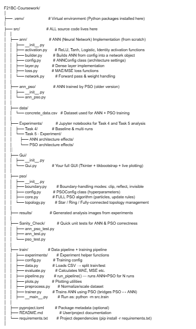

# F21BC-Coursework
The aim of this assessment is to increase the understanding of artificial neural networks (ANNs)  and particle swarm optimisation (PSO), two biologically-inspired techniques which are taught in  the course. It involves implementing both ANN and PSO, experimentally investigating how PSO can  be used to optimise an ANN to carry out a specified task

## PG05 PG-CW-2025
1.  Bhagya Withanage - H00481008
2.  Steny Saji- H00486681

### How to Configure the project
IDE -pycharm
-Create Virtual Environment - `python -m venv .venv`
-Activate Virtual Environment - `.venv\Scripts\activate`
-Install Dependencies- pip install `-r requirements.txt`
-Run the project-python `src/__main__.py`

### How to Run
- Install dependencies
Activate the virtual environment from `requirements.txt`
 
  Entry point: `src/__main__.py`
  
  This initializes configurations and launches training via `run_pipeline()`.

- Experiments conducted are in the notebooks for tasks 4 and 5

### Folder Structure

